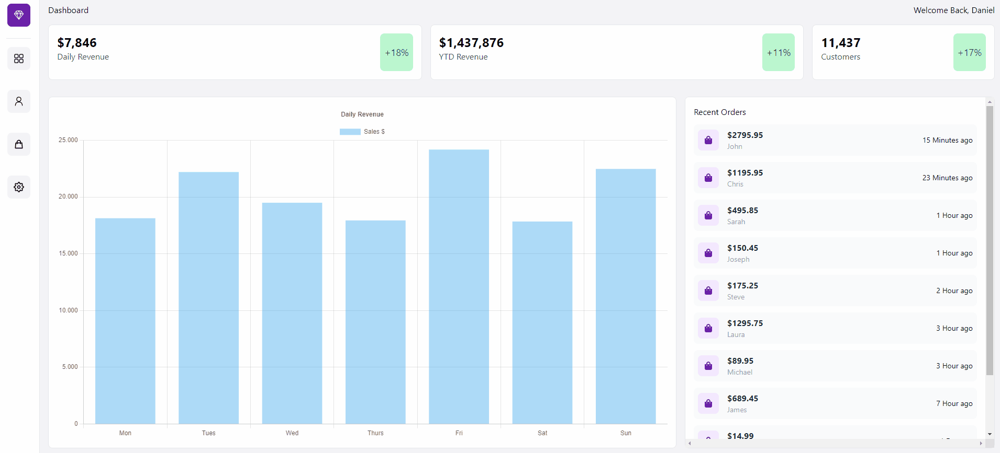
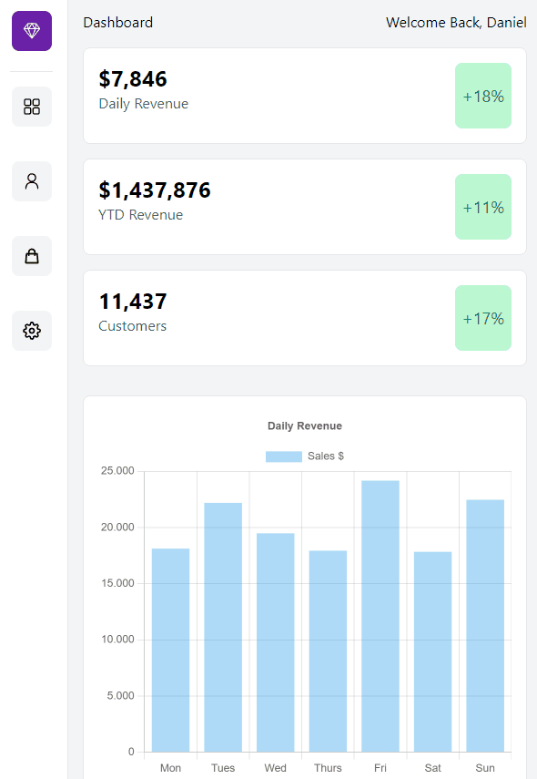

# Dashboard
Esse website foi feito utilizando, React.js, Next.js e TailwindCSS.

Utilizei esse projeto de Dashboard para aplicar alguns conceitos práticos para aperfeiçoar meu Next.js e TailwindCSS.

Para clonar o repositório:
- Tenha baixado o Node em seu computador.
- Abra o terminal da sua IDE, e digite `npm install`.
- Logo após a instalação, digite `npm start` para rodar o programa com o BrowserSync.

#
This minigame was made using React.js, Next.js e TailwindCSS.

I used this Dashboard project to apply some practical concepts to improve my Next.js and TailwindCSS.

To clone the repository:
- Have Node downloaded on your computer.
- Open your IDE's terminal, and type `npm install`.
- Right after installation, type `npm start` to run the program with BrowserSync.

## :camera_flash: Dashboard GIF
# Desktop:

# Mobile:
